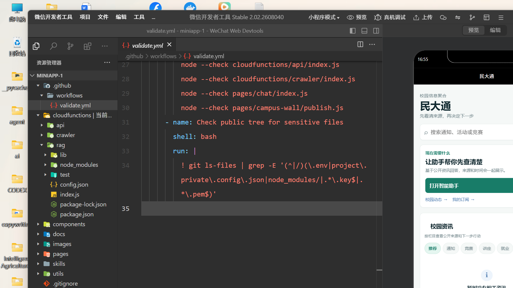

# 页面验证截图

这些截图用于记录页面重构后的开发者工具验证结果，不代表线上发布状态。

## 本次验证

`devtools-current-after-ui.png` 为本次首页 UI 重构后，在微信开发者工具预览区域抓取的实际画面。可以看到首页已经收敛为：品牌说明、搜索、单一主任务“打开智能助手”、两个次级入口和栏目资讯列表。

`preview-qr.png` 为微信开发者工具 CLI 生成的预览二维码；`preview-info.json` 记录本次预览包大小。本次预览包为约 1.6 MB，已通过 2 MB 限制。

## 截图原则

- 截图前关闭调试浮层，遮挡账号、环境标识、日志和任何凭证；
- 页面数据为空时，不用演示基金、虚构通知或虚假收益填充；
- 截图只用于验证页面层级、状态和交互入口，不等同于线上验收；
- 发布前仍需在已登录的微信开发者工具中完成真机预览和真实数据验收。
